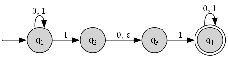
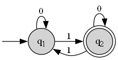
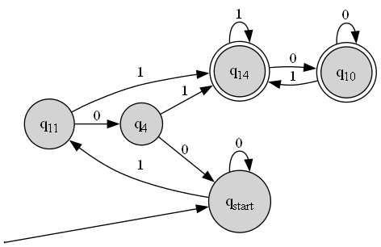

# Automata Tools

A small toolkit for working with [Automata theory](https://en.wikipedia.org/wiki/Automata_theory), built to support my Theory of Computation class.

Instead of drawing automata by hand each time, I wanted to save time creating and rendering automata from a simple text format (`.dfauto`, `.nfauto`). It helps me focus on understanding concepts rather than worrying about drawing arrows and circles.
## Project Structure

```
automata/      # Core library
  automaton.py # Base Automaton (shared logic for DFA/NFA; (Q, Σ, δ, q0, F))
  dfa.py       # Deterministic Finite Automaton (DFA) dataclass 
  nfa.py       # Nondeterministic Finite Automaton (NFA) dataclass
  parser.py    # Parse .dfauto / .nfauto files into Automatons
  utils.py     # Utility functions (colors, printing, formatting, etc.)
  FORMAT.md    # Text format specs

cli/           # Command-line tools
  convert.py   # Convert from one automaton type to another
  info.py      # Show tuples for describing an automaton
  render.py    # Render Automaton diagram as image file
  sample.py    # Generate sample words that automaton accepts
  simulate.py  # Test word acceptance and output results
  ...          # (future tools)

examples/      # Example automata

results/       # Output images and txts
```

### Installation

Clone this repository and install the required dependencies:

```bash
git clone https://github.com/your-username/automata-tools.git
cd automata-tools
pip install -r requirements.txt
```

#### Requirements

- Python 3.10+

- Graphviz
  - You need both the system binary and the Python package.
  - Download and install from [graphviz.org/download](https://graphviz.org/download)
  - ⚠️ On Windows: during installation, make sure the Graphviz bin/ folder is added to your PATH.

## Usage
### Inspect Automaton

```bash
python -m cli.info examples/example.nfauto
```

Output:

```bash
NFA 5-tuple:
  Q  = {'q_1', 'q_4', 'q_2', 'q_3'}
  Σ  = {'1', '0'}

Transition Table δ:
state |   0 |       1 |   ε
------+-----+---------+----
  q_1 | q_1 | q_1,q_2 |   -
  q_2 | q_3 |       - | q_3
  q_3 |   - |     q_4 |   -
  q_4 | q_4 |     q_4 |   -

  q0 = q_1
  F  = {'q_4'}

Counts:
  |Q| = 4
  |Σ| = 2
  |δ| = 12
  |F| = 1
```
For reference: 



### Render Automaton to image

```bash
python -m cli.render examples/example.dfauto

# Output format (png/svg/pdf)
python -m cli.render examples/example.dfauto --fmt svg

# Custom output filename
python -m cli.render examples/example.dfauto -o results/example_graph_dfa.png # default {name}.png e.g. example.png
```

Output:



### Generate Sample Words

```bash
python -m cli.sample examples/example.dfauto

# with max samples and length
python -m cli.sample examples/example.dfauto --max-samples 10 --max-length 10

# with output file
python -m cli.sample examples/example.dfauto --out results/sample_words.txt
```

Output:
```bash
Sampled 10 strings from the NFA
'11' '011' '101' '110' '111' '0011' '0101' '0111' '1011' '1101'
```
For reference:


### Simulate Word Input

```bash
python  -m cli.simulate examples/example.dfauto 1101 11 2

# with output file
python  -m cli.simulate examples/example.dfauto 1101 11 2 --out results/sim_res.txt

# with input file
python  -m cli.simulate examples/example.dfauto --in examples/example_words.txt
```

Output:

```bash
'1101' -> Accepted
'11' -> Rejected
'2' -> Error: Symbol '2' not in alphabet Σ = ['0', '1']
Results written to results/simulation_results.txt # If has output file
```

For reference:


## Convert from DFA to NFA and vise-versa

```bash
python -m cli.convert examples/example.nfauto --to dfa

# with output file
python -m cli.convert examples/example.nfauto --to dfa --out results/example_converted
```

Output:
```bash
Converted to NFA and written to results\example_converted.dfauto and rendered image to results/example_converted.png
```


From:


## License

This project is licensed under the MIT License — see the [LICENSE](LICENSE) file for details.
